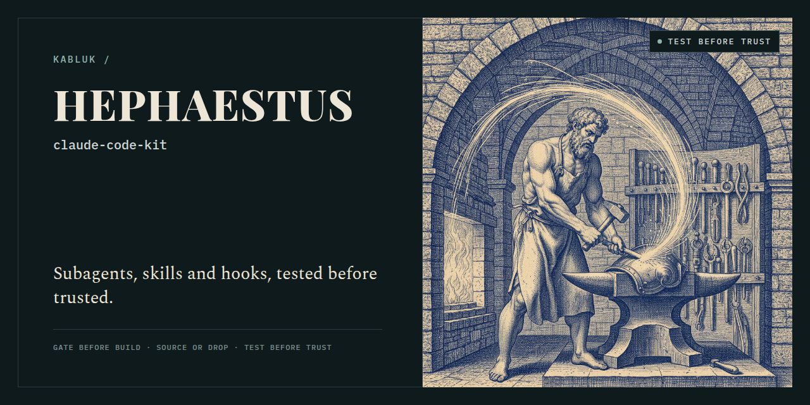

# claude-code-kit



[](https://github.com/kabluk/claude-code-kit/actions/workflows/ci.yml)

The Claude Code toolkit I reuse across 7+ repositories: role subagents, slash commands,
skills and hooks. It lives apart from any product because copy-pasted `.claude/` folders
drift silently.

## What's inside

| Folder | Contents |
|---|---|
| `agents/` | 9 role subagents: backend, frontend, data, devops, QA, architect, product, growth, niche-finder |
| `commands/` | 13 slash commands: `/analyze`, `/discover`, `/deepdive`, `/roadmap`, `/task-loop`, `/workflow-graph`, … |
| `skills/` | 11 skills: `harvest`, `external-review`, `ui-from-screenshot` (Playwright pixel diff), `ux-ease-audit`, `writing-for-agents`, … |
| `hooks/` | `session-start.sh` (start-of-session ritual), `stop-cycle.sh` (no finishing a cycle that had commits without next-step options and a harvest reminder) |
| `scripts/` | `context_monitor.py` (warns before the context window fills, with tests), `orphan-branches.sh` |
| `docs/playbook/` | `COLLABORATION.md` (the cross-project rules the hooks refer to), `HARVEST.md` (ledger of extracted lessons) |

## Install

```bash
git clone https://github.com/kabluk/claude-code-kit ~/claude-code-kit
cd your-project && mkdir -p .claude
cp -r ~/claude-code-kit/{agents,commands,skills} .claude/
```

Cloud sessions don't follow symlinks, so copy rather than link.

## Hooks setup

The hooks and scripts are optional. They expect to live under `.claude/` and the
playbook under `docs/playbook/`:

```bash
cp -r ~/claude-code-kit/{hooks,scripts} .claude/
mkdir -p docs && cp -r ~/claude-code-kit/docs/playbook docs/
cp ~/claude-code-kit/settings.example.json .claude/settings.json   # or merge into yours
```

`settings.example.json` wires them up:

| Event | Command | What it does |
|---|---|---|
| `SessionStart` | `bash .claude/hooks/session-start.sh` | Injects the start ritual and the `caveman` style rules, lists which credentials are set (names only) |
| `UserPromptSubmit` | `python3 .claude/scripts/task_profiler.py` | Suggests Haiku / Sonnet / Opus for the prompt |
| `UserPromptSubmit` | `python3 .claude/scripts/context_monitor.py` | Warns at 70 % context, hands over a new-session prompt at 85 % |
| `Stop` | `bash .claude/hooks/stop-cycle.sh` | Blocks the end of a cycle that committed without three next-step options |

The hooks need `bash` and `python3`; `session-start.sh` uses `jq` when present.
`context_monitor.py` assumes a 1M-token window; set `CONTEXT_LIMIT_TOKENS` to change it,
and optionally `CONTEXT_HANDOFF_CHECK` to a command the next session should run first.

## Test before trust

The hooks exist because agents finish confidently. `stop-cycle.sh` reads the session
transcript: if the agent committed, pushed or merged since your last message but has not
offered three next-step options, the stop is blocked once, with a reminder to harvest the
lessons into rules or skills first if that has not happened.

## License

MIT. `skills/caveman/` is vendored third-party work under its own MIT notice; see
`skills/caveman/NOTICE.md`.
